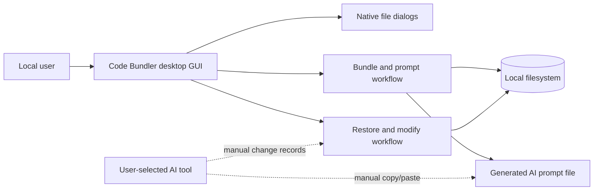
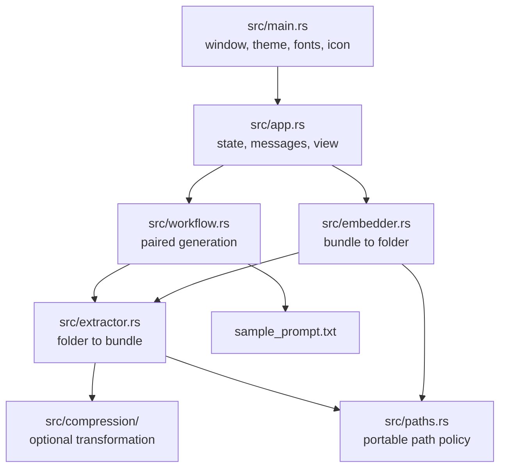
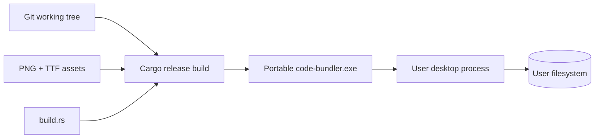

# Architecture

## Observed architecture

Code Bundler is a single-process, event-driven desktop application. It has no
backend, database, network client, plugin runtime, or separately deployed
component. The executable owns the GUI state and delegates blocking local
filesystem workflows through Iced tasks.

The dotted relationship is outside the application boundary. Code Bundler does
not know which AI tool is used and does not transmit data.

## Runtime components

`embedder` depends on `extractor` only for shared format constants and text
decoding. There is no public library API; all modules are crate-private.

## Component responsibilities

| Component | Responsibility |
| --- | --- |
| `main` | Configure Iced, load embedded fonts/icon, set window dimensions, start event loop. |
| `app` | Hold transient UI state, translate messages into tasks, validate required selections, render notices. |
| `workflow` | Coordinate bundle/prompt output names and pairwise cleanup; stream prompt output. |
| `extractor` | Walk a folder, honor ignore rules, classify/decode files, serialize the v1 bundle. |
| `compression` | Apply extension-routed lexical whitespace reduction. |
| `embedder` | Parse a v1 bundle and optional content/file changes, validate, create the final output tree. |
| `paths` | Enforce the shared relative-path and portability contract. |
| `build.rs` | Generate Windows icon resources and metadata during compilation. |

## Communication paths

- UI updates are synchronous state transitions through `app::update`.
- File dialogs and long operations return `iced::Task<Message>` values.
- Completion is normalized to `Message::Finished(Result<String, String>)`.
- Core modules return domain reports on success and user-readable `String`
  errors on failure; there is no typed cross-module error hierarchy.
- All durable communication occurs through user-selected local files.

## Data boundaries

1. **Operating-system boundary:** native window and file dialogs; filesystem permissions.
2. **Project input boundary:** project paths and file bytes are user-controlled.
3. **Bundle boundary:** a selected bundle is untrusted structured text and is fully validated before directory creation.
4. **Change-file boundary:** line replacements and add/delete/rename records are
   untrusted text and are validated before output creation.
5. **Manual AI boundary:** generated prompts may leave the machine only through an action taken outside this application.

## External dependencies

| Dependency | Role |
| --- | --- |
| Iced | GUI, event loop, rendering, shaping, and task executor. |
| `rfd` | Native folder/file selection dialogs. |
| `ignore` | Recursive walking and `.gitignore` semantics. |
| `image` | Decode the embedded PNG at runtime and build time. |
| `ico`, `winresource` | Windows-only build-time executable resources. |

There are no runtime SaaS, HTTP, database, queue, cache, or authentication dependencies.

## Deployment architecture

The x86_64 Windows MSVC release statically links the C runtime. Current release
artifacts are checked into `dist/`; the CI workflow validates code but does not
publish releases.

## Scalability characteristics

- Scale is vertical and local; there is no horizontal scaling concept.
- Source files are processed sequentially, with one file buffered at a time.
- Bundle restoration buffers the complete bundle plus parsed entry content.
- Change grouping and structural-operation planning use hash maps keyed by
  normalized path and original file index.
- There are no configured limits for project size, file count, or file size.

## Reliability characteristics

- New-output semantics protect existing data.
- Strict framing avoids delimiter ambiguity inside file contents.
- Generation removes incomplete bundle/prompt artifacts in its handled failure paths.
- Restore validates before output directory creation, but a filesystem failure
  during writing can leave an explicitly reported incomplete directory.
- No retry, journal, transaction, checkpoint, or resume mechanism exists.

## Known architectural concerns

- Core errors are strings, which simplifies GUI display but prevents structured handling.
- `extractor` means folder-to-bundle and `embedder` means bundle-to-folder;
  those internal names are opposite of common archive terminology and the GUI labels.
- GUI and workflow tests exercise logic but not a real event loop or native dialogs.
- The custom compressors are lexical state machines, not language parsers.
- The application has no cancellation, progress reporting, logging, or crash recovery.
- Strict case-insensitive portability rejects some project layouts valid on case-sensitive filesystems.

No recommendation in this section is presented as implemented behavior.
