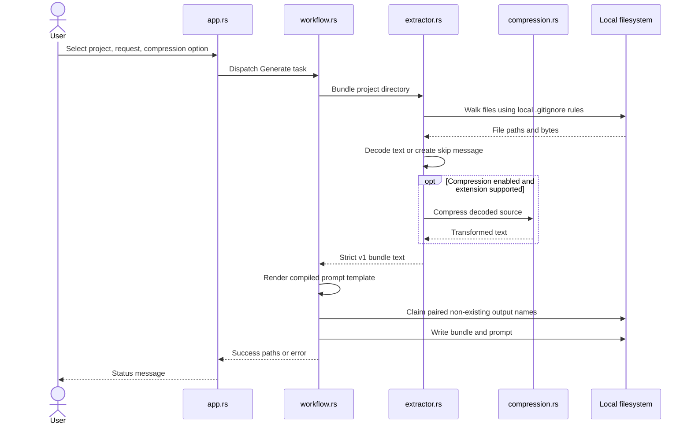
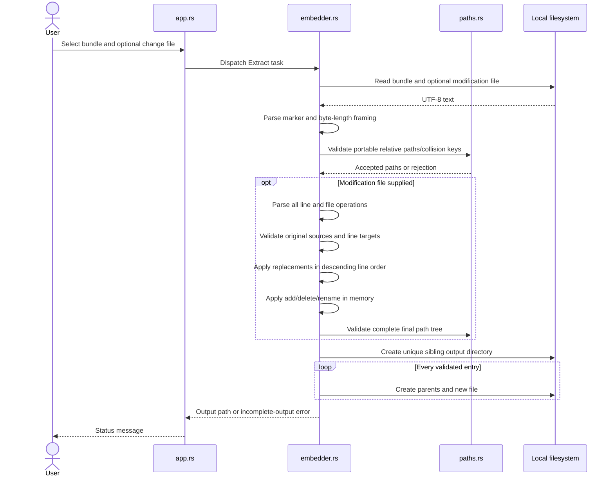
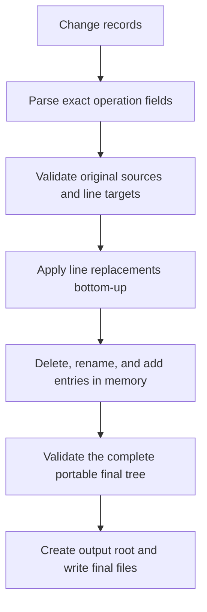

# Data Flow

## Boundaries

All application data flow stays between the GUI, in-process Rust modules, and
the local filesystem. There is no network, database, queue, background service,
or AI-provider connection.

## Generate flow

### Generate transformations

1. `app.rs` normalizes path text and copies the current form state into a task.
2. `workflow.rs` validates that the source is a directory.
3. `extractor.rs` walks regular files without following symbolic links.
4. Local `.gitignore` rules, VCS pruning, and generated-output exclusions filter paths.
5. Each file is decoded as supported text or replaced by a readable skip message.
6. Optional extension-aware compression runs on decoded text.
7. Relative portable paths and UTF-8 byte lengths are serialized into the v1 bundle.
8. `workflow.rs` substitutes the request and bundle path into `sample_prompt.txt`.
9. A bundle/prompt filename pair is claimed without overwriting existing files.

Generation processes source files sequentially and buffers one source file at a
time. The bundle is written as entries are scanned, and prompt generation
streams the completed bundle into the prompt instead of loading a second full
copy into memory.

## Restore flow

### Validation boundary

Before creating an output directory, restore validates:

- the exact v1 marker and every framed entry;
- UTF-8 byte lengths and end-of-input;
- portable relative path syntax;
- case-insensitive duplicates and file/directory conflicts;
- change syntax, original source existence, line range, duplicate targets,
  incompatible source operations, and the complete final path tree.

Filesystem failures can still occur after validation. A late failure is
reported with the path of the incomplete directory; there is no transactional
filesystem rollback.

## Change-set flow

Descending application prevents earlier replacements from shifting the
positions of later requested lines. Physical continuation lines following a
record become additional replacement lines. The preferred line-ending style of
the original decoded file is retained where the algorithm introduces line
endings.

Structural operations are simultaneous with respect to original paths. This
allows a line-edited file to be renamed and allows destinations vacated by
another delete/rename, provided the final tree contains no collision. Parent
directories for added and renamed paths are created during output.

## Data representations

| Data | Representation | Lifetime |
| --- | --- | --- |
| GUI input | Rust strings/booleans in app state | Process/session |
| Source bytes | Filesystem bytes decoded in memory | Generate task |
| Bundle | Strict v1 UTF-8 framed text | Memory, then persistent user file |
| Prompt | Compiled template with substitutions | Memory, then persistent user file |
| Change set | UTF-8 replacement/add/delete/rename records parsed in memory | Restore task |
| Restored project | New local directory and files | Persistent until user removes it |

There is no application-owned data store or retention process. The user owns
the generated and restored files.
