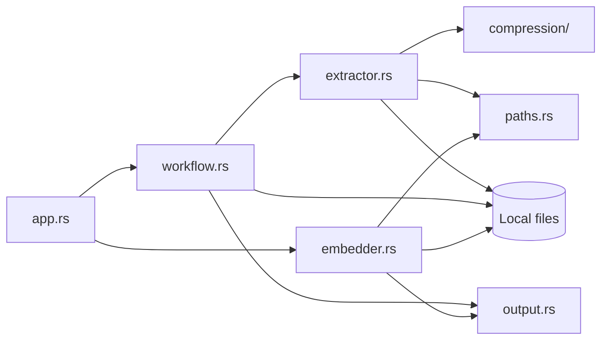

# Architecture and Technical Contracts

## Runtime and modules

Code Bundler is one Rust binary with an Iced GUI and local filesystem workflows.
There is no backend, database, account system, network API, or automatic AI
connection. Transient UI state has a `busy` guard; synchronous core workflows
return reports or user-facing `String` errors through Iced tasks.

| Source | Responsibility |
| --- | --- |
| [main.rs](../src/main.rs) | Window, theme, embedded fonts, and icon. |
| [app.rs](../src/app.rs) | State/messages, forms, dialogs, tasks, notices, and output shortcuts. |
| [workflow.rs](../src/workflow.rs) | Bundle/prompt coordination, naming, template rendering, and cleanup. |
| [extractor.rs](../src/extractor.rs) | Discovery, classification, decoding, and serialization. |
| [embedder.rs](../src/embedder.rs) | Bundle/change parsing, validation, modification, and restore writes. |
| [output.rs](../src/output.rs) | Resolve `Documents/code_bundler` through `dirs`. |
| [paths.rs](../src/paths.rs) | Portable components and case-insensitive collision keys. |
| [compression/](../src/compression/) | Extension routing and brace/Python compactors. |
| [build.rs](../build.rs) | Windows icon and executable metadata. |

Iced provides rendering, advanced shaping, and a thread-pool executor; `rfd`
provides dialogs, `ignore` walking rules, and `image` artwork decoding.
`ico` and `winresource` are Windows-only build dependencies.



## Data flow and naming

**Generate:** resolve output location, discover/validate paths, sort
case-insensitively, then decode/compress and write entries sequentially. One
source file is buffered at a time. For a non-empty request, buffered I/O streams
the completed bundle into the compiled template. `sample_prompt.txt` must
contain `PASTE THE BUNDLED REPOSITORY HERE` followed by
`PASTE THE CHANGE REQUEST HERE`. The request is trimmed.

Project names retain alphanumeric characters, `-`, and `_`; other runs become
`_`, outer underscores are removed, and empty names become `project`. Required
bundle/prompt names share the first available suffix. Files use `create_new`;
failed generation removes incomplete files when possible, including a bundle
whose prompt creation failed.

**Extract:** decode/parse the full bundle, validate paths, parse optional
changes, apply original-line edits bottom-up, form the simultaneous
add/delete/rename result, and validate the final tree. Then claim
`<bundle-stem>_embedded[_N]` under the shared output directory with `create_dir`
and create files exclusively. Skipped binary entries produce no file. Late I/O
errors identify an incomplete directory and leave it for inspection.

## Bundle format v1

```text
==code-bundler:v1==
==relative/path.ext content==
==utf8-bytes:N==
<exactly N UTF-8 bytes of content>
<one separator newline>
```

`N` counts content after decoding/compression, preserving empty files, final
newlines, and header-like source text. Skipped entries use
`[Skipped: binary file]` instead of length metadata and stored bytes.

The parser requires the exact v1 marker and checks length arithmetic, bounds,
UTF-8 boundaries, and separators. Content ending exactly at end-of-document may
omit the separator. Unknown/unversioned input is rejected without fallback.

### Decoding and discovery

A NUL in the first 8,192 bytes marks data as binary unless a UTF-16 LE/BE BOM
is present. UTF-32 BOMs are rejected. UTF-16 needs even byte counts and valid
surrogate sequences; UTF-8 may include a BOM. Failed source decoding becomes a
skip entry; an undecodable bundle/change file rejects restoration. UTF-16 is
converted to UTF-8, so original encoding bytes are not preserved.

Discovery honors only root/nested `.gitignore`, includes unignored hidden
files, prunes VCS metadata, and never follows symlinks. Nested output directories
and root-level generated TXT names are excluded. Read failures accumulate as
warnings. Paths, case-insensitive collisions, and file/parent conflicts are
validated before the bundle file is created.

## Changes and portable paths

[USER-GUIDE.md](USER-GUIDE.md#modification-files) defines record syntax and
escapes. Original path keys map to entry indexes. The engine validates sources,
line spans, and duplicate/incompatible operations; applies descending
replacements with normalized target line endings; then deletes, renames, and
adds entries in memory. Final-tree validation permits conflict-free rename swaps.

Paths contain `/`-separated, non-empty Unicode components. Reject absolute
paths, `.`/`..`, control characters, `<>:"\|?*`, trailing dots/spaces, and
Windows device basenames: `CON`, `PRN`, `AUX`, `NUL`, `COM1` through `COM9`,
`LPT1` through `LPT9`, `CONIN$`, and `CONOUT$`, including names with extensions.
Lowercased keys detect duplicates and file/parent conflicts in the final tree.

The process inherits user OS permissions. Exclusive output creation and path
validation protect against routine overwrites and traversal. Shortcuts launch
the OS file explorer with arguments; bundle/change content is never executed.
There is no secret scanning, encryption, size limit, or pinned source handle;
plain-text disclosure, resource exhaustion, and source replacement during
scanning remain concerns.

## Compression and reliability

Python routing covers `py`, `pyi`, and `pyw`. Brace routing covers PHP variants,
C/C++ sources/headers, C#, Java, Kotlin, Rust, CSS/SCSS/Less, and JSON. Other
extensions stay unchanged.

Brace compression preserves comments, quote escapes, line-comment endings,
and Rust raw strings; PHP heredoc/nowdoc and C++ raw-string candidates trigger
conservative copying of the remaining text. Python preserves indentation,
content/comment newlines, and quoted/triple-quoted strings while reducing
intra-line whitespace and blank lines outside multiline strings. Both are
lexical state machines without AST/compiler validation.

There is no cancellation, retry, journal, cache, progress telemetry, or
transactional restore rollback. Testing/release gaps are in
[DEVELOPMENT.md](DEVELOPMENT.md).
